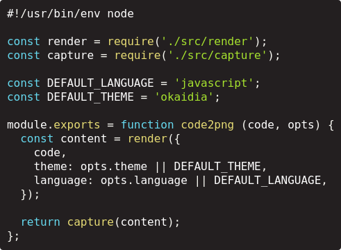

code2png
===============================================================================

Generate PNG images of source files--convenient for HTML-filtering input forms,
Twitter, and all kinds of groovy things like that.

```sh
$ cat bin/code2png | head -n5 | code2png -o readme.png
```



Installation
-------------------------------------------------------------------------------

```sh
$ npm install -g code2png
```

TODO
-------------------------------------------------------------------------------

- Support additional languages, themes

License
-------------------------------------------------------------------------------

MIT
